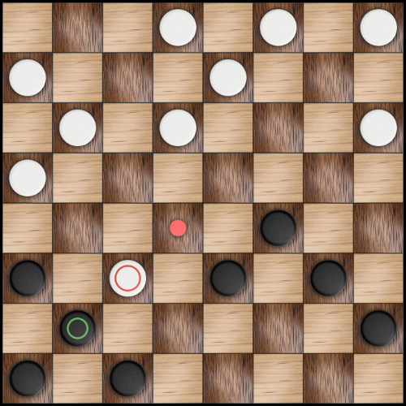

# Richers
Richers is a cross-platform checkers game. 
Application has been written in Qt Framework using C++ language.

## Build instructions

* Clone the Richers game repository.
* Move into the **src** directory and run **qmake** utility to generate Makefile.
* Build the executable using **make** automation tool.
* Run Richers.
